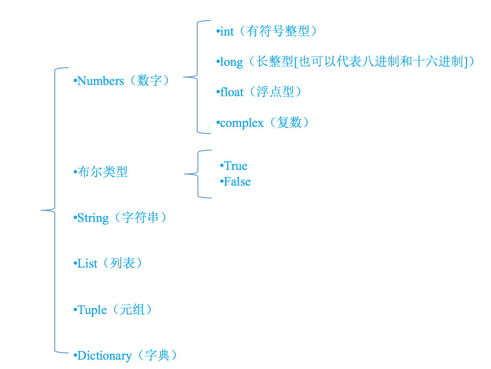

# 变量类型

变量存储在内存中的值。这就意味着在创建变量时会在内存中开辟一个空间。

基于变量的数据类型，解释器会分配指定内存，并决定什么数据可以被存储在内存中。

因此，变量可以指定不同的数据类型，这些变量可以存储整数，小数或字符。


1. 变量

    python变量是动态的（它自动地跟踪你的类型而不是要求声明代码），但也是强类型语言（只能对一个对象进行适合该类型的有效的操作）。
    在Python中类型属于对象，而不是属于变量，变量只是指向对象的引用或者叫地址。比如
    
    ```
        a=3
        #变量a指向对象3的地址
    ```
    
    python中每个对象都有一个引用计数器，一旦这个计数器被设置为零，这个对象的内存空间就会被回收。
    
    **思考 循环检测器？？？*
3. Python标识符

    * 在 Python 里，标识符由字母、数字、下划线组成。
    
    * 在 Python 中，所有标识符可以包括英文、数字以及下划线(_)，但不能以数字开头。
    
    * Python 中的标识符是区分大小写的。
    
    * 以下划线开头的标识符是有特殊意义的。
    
    * 以双下划线开头的 __foo 代表类的私有成员；以双下划线开头和结尾的 __foo__ 代表 Python 里特殊方法专用的标识，如 __init__() 代表类的构造函数。
    * 见名知义
    	* 小驼峰
    	* 大驼峰
    	* 下划线链接
    * 不能和关键字重名

    	关键字，是python已经使用的了，所以不允许开发者自己定义和关键字相同的名字的标示符
    	查看关键字：
    	```
    		import keyword
    		keyword.kwlist
    	```
    
    * Python 可以同一行显示多条语句，方法是用分号 ; 分开

    ```
        #如果要判断的字符串过多可以这样写
        lst = [str1, str2]
        # _ 只有单个下划线的变量名会保存最后表达式的结果
        in_lst = [_ for _ in lst if word in _]
    ```

1. 变量赋值    

    ```
        a = b = c = 1
        a, b, c = 1, 2, "john"
    ```
      
2. 标准数据类型


    在内存中存储的数据可以有多种类型。
    
    例如，一个人的年龄可以用数字来存储，他的名字可以用字符来存储。
    
    Python 定义了一些标准类型，用于存储各种类型的数据。
    
    Python有五个标准的数据类型：
    
    *   Numbers（数字）
    *   String（字符串）
    *   List（列表）
    *   Tuple（元组）
    *   Dictionary（字典）
    *   Set(集合)

    
    
    1. 在python中，只要定义了一个变量，而且它有数据，那么它的类型就已经确定了，不需要咱们开发者主动的去说明它的类型，系统会自动辨别
    2. 可以使用type(变量的名字)，来查看变量的类型
3. Python数字

    Python支持四种不同的数字类型：

   1. int（有符号整型）
   2. long（长整型[也可以代表八进制和十六进制]）
   3. float（浮点型）
   4. complex（复数）

	    ```
	        a=12
	        lon=123L
	        flo=12.3E100
	        com1=3.14j
	        com2=4.53e-7j
	    ```
	   >长整型也可以使用小写 l，但是还是建议您使用大写 L，避免与数字 1 混淆。Python使用 L 来显示长整型。
	Python 还支持复数，复数由实数部分和虚数部分构成，可以用 a + bj,或者 complex(a,b) 表示， 复数的实部 a 和虚部 b 都是浮点型。
	
	
	
	    ```
4. 类型转化

	```
		a=12
		m=3.1415
		s='12.5'
		
		print(int(m))  		#float ==> int
		print(float(a))		#int==>float
		#保留两位小数
		print(float('%.2f' % m))
		print(round(m,2))
		
		print(str(a))	  		#int==>str
		print(float(s)+2)	
		print(s+2)			#error
		print(s+str(2))
		
		str='3+2.5'
		print(eval(str))
	```
8. Python数据类型转换

    |函数 |	描述|
    |---|---|
    |int(x [,base])|将x转换为一个整数|
    |long(x [,base] )|将x转换为一个长整数|
    |float(x)|将x转换到一个浮点数|
    |complex(real [,imag])|创建一个复数|
    |str(x)|将对象 x 转换为字符串|
    |repr(x)|将对象 x 转换为表达式字符串|
    |eval(str)|用来计算在字符串中的有效Python表达式,并返回一个对象|
    |tuple(s)|将序列 s 转换为一个元组|
    |list(s)|将序列 s 转换为一个列表|
    |set(s)|转换为可变集合|
    |dict(d)|创建一个字典。d 必须是一个序列 (key,value)元组。|
    |frozenset(s)|转换为不可变集合|
    |chr(x)|将一个整数转换为一个字符|
    |unichr(x)|将一个整数转换为Unicode字符|
    |ord(x)|将一个字符转换为它的整数值|

    >python 的所有数据类型都是类,可以通过 type() 查看该变量的数据类型:
    
    type()不会认为子类是一种父类类型。
 isinstance()会认为子类是一种父类类型。
6. Python元组
    
    元组是另一个数据类型，类似于List（列表）。

    元组用"()"标识。内部元素用逗号隔开。但是元组不能二次赋值，相当于只读列表。
    
    ```
        tu=(11,22,33,44)
        tu[0]=88  #TypeError: 'str' object does not support item assignment
    ```

7. Python 字典

    字典(dictionary)是除列表以外python之中最灵活的内置数据结构类型。列表是有序的对象集合，字典是无序的对象集合。

    两者之间的区别在于：字典当中的元素是通过键来存取的，而不是通过偏移存取。

    字典用"{ }"标识。字典由索引(key)和它对应的值value组成。
    
    ```
        users=[
        {"name":"tom","age":12},
    	{"name":"tony","age":12},
    	{"name":"anli","age":12},
    	{"name":"dapen","age":12}
        ]
        for item in users:
        	for v in item.values():
        		print(v)
        
        	for k in item.keys():
        		print(k)
    
        for item in users:            
	       for k in item.keys():     
		      print(k,":",item[k])  
		      
	   users[0][3]='haha'
                              
    ```
    ```
    switcher={              
        0:'zero',       
        1:'one',        
        2:'two',        
        3:lambda:"three"
    }                   
                        
    print(switcher.get(3)())
    ```

#补充
1. 可变对象拷贝

    ```
        list1=[1,2,3]
        list2=list1 #这是重复引用，不是拷贝
        
        list3=list1[:] #拷贝
        list4=list1.copy()
        
        #检查对象是否相等
        
        list1==list3 #true 比较的是内容
        list1 is list3 #false 比较的是地址是否是同一个地址
    ```

    但是
    
    ```
        X=12
        Y=12
        X IS Y # True
    ```

    >这是因为python缓存并复用了小整数和小字符串，即使执行x=14，对象12也不会被回收，他将可能被保存在一个系统表中，等待你的代码下次使用12这个对象。
    
    可以通过以下代码来验证对象被引用的次数
    
    ```
        import sys
        x=12
        y=12
        z=12
        
        print(sys.getrefcount(12))
        
    ```

